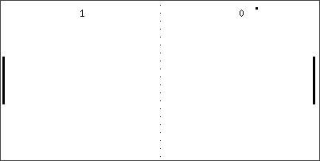

     _ _ _       ___
    | (_) |__   / _ \___  _ __   __ _
    | | | '_ \ / /_)/ _ \| '_ \ / _` |
    | | | |_) / ___/ (_) | | | | (_| |
    |_|_|_.__/\/    \___/|_| |_|\__, |
                                |___/


A minimalistic portable C library to implement Pong game.

## Building

You can build the static libraries and the samples with:

```
mkdir build
cd build
cmake ..
make
```

## Samples

Currently there is samples in ncurses and x11 implementation.

### ncurses


### X11


## Contributing

A beer shall be given to those who contribute with a language binding
or using it in a rendering framework.
